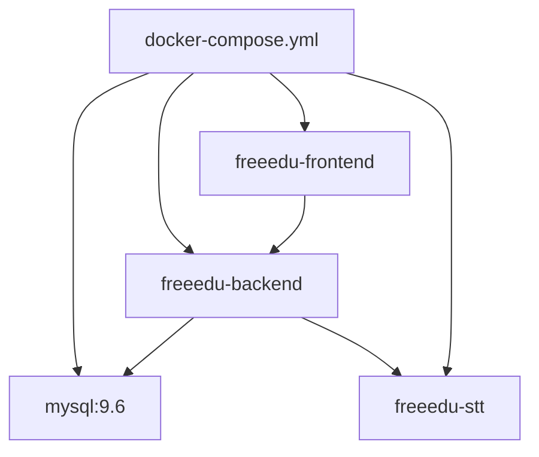

# Docker i runtime

Lokalne srodowisko sklada sie z czterech kontenerow:
- `mysql` -> [[Model danych]]
- `backend` -> [[Backend]]
- `frontend` -> [[Frontend]]
- `stt-service` -> [[STT Service]]

Pelna sciezka startu lokalnego jest w [[Uruchomienie lokalne]], a najczestsze awarie w [[Troubleshooting]].

Porty:
- backend: `${BACKEND_PORT}:8080`
- frontend: `5173:5173`
- stt-service: `${STT_PORT}:8000`
- mysql: `3306:3306`

Zrodla:
- [docker-compose.yml](../../docker-compose.yml)
- [.env.example](../../.env.example)
