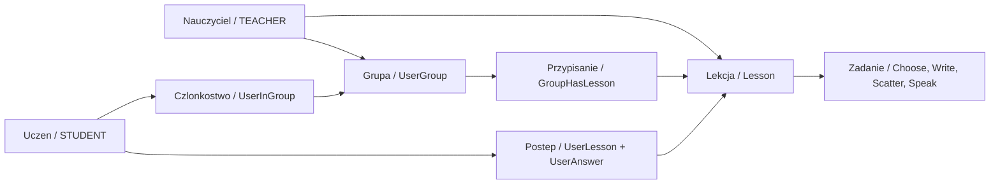

# Glosariusz domenowy

Ta notatka tlumaczy nazwy biznesowe na miejsca w kodzie. Traktuj ja jako pierwsze miejsce, gdy w tasku pojawia sie nazwa domenowa.

| Pojecie biznesowe | Znaczenie w systemie | Nazwy techniczne w kodzie | Powiazane notatki |
|---|---|---|---|
| Uzytkownik | Konto osoby w systemie. Ma role i dane logowania. | `User`, `UserResponse`, `UserRepository` | [[Domena - uzytkownicy]], [[Security]] |
| Rola | Uprawnienie wysokiego poziomu: admin, nauczyciel albo uczen. | `Role.ADMIN`, `Role.TEACHER`, `Role.STUDENT` | [[Macierz rol i uprawnien]] |
| Admin | Osoba zarzadzajaca systemem i kontami. | `/api/v1/admin/**`, `AdminService` | [[Rola - Admin]] |
| Nauczyciel | Tworzy lekcje, zadania, grupy i zarzadza swoimi uczniami. | `TeacherService`, `/api/v1/teacher/**` | [[Rola - Teacher]] |
| Uczen | Widzi przypisane lekcje, rozwiazuje zadania i ma postep. | `StudentService`, `/api/v1/student/**` | [[Rola - Student]] |
| Grupa | Zbior uczniow prowadzony przez nauczyciela. Uczen nalezy do jednej grupy. | `UserGroup`, `UserInGroup`, `UserGroupService` | [[Domena - grupy]] |
| Czlonkostwo w grupie | Relacja uczen -> grupa. | `user_in_group`, `UserInGroup` | [[Domena - grupy]] |
| Lekcja | Jednostka materialu tworzona przez nauczyciela i przypisywana do grup. | `Lesson`, `LessonRequest`, `LessonResponse` | [[Domena - lekcje]] |
| Przypisanie lekcji do grupy | Relacja grupa -> lekcja. Decyduje, czy uczen widzi lekcje. | `GroupHasLesson`, `group_has_lesson` | [[Domena - lekcje]], [[Domena - grupy]] |
| Zadanie | Element lekcji rozwiazywany przez ucznia. | `ChooseTask`, `WriteTask`, `ScatterTask`, `SpeakTask` | [[Domena - zadania]] |
| Sekcja zadania | Grupowanie zadan w widoku lekcji. | `section`, `TaskSectionDto` | [[Domena - zadania]] |
| Podpowiedz | Tekst pomocniczy przy zadaniu. | `hint` | [[Domena - zadania]] |
| Postep ucznia | Stan lekcji dla ucznia oraz zapis odpowiedzi. | `UserLesson`, `UserAnswer`, `UserLessonStatus` | [[Domena - postep studenta]] |
| Enrollment | W tym projekcie nie ma osobnego endpointu zapisu na kurs. Dostep ucznia wynika z przypisania ucznia do grupy i lekcji do tej grupy. | `user_in_group` + `group_has_lesson` | [[Domena - grupy]], [[Domena - lekcje]] |
| Dashboard | Widok BFF dla roli, agregujacy dane do panelu. | `AdminDashboardController`, `TeacherDashboardController`, `StudentDashboardController` | [[Frontend]] |
| Ownership check | Sprawdzenie, czy uzytkownik moze operowac na danym zasobie. | `SecurityService`, `@PreAuthorize` | [[Security]], [[Macierz rol i uprawnien]] |
| STT | Rozpoznawanie mowy dla zadania `speak`. | `STT Service`, `transcribeSpeakTask` | [[STT Service]], [[Przeplyw - rozpoznawanie mowy]] |

## Najwazniejsze relacje

## Zrodla

- [user model](../../backend/src/main/java/pl/freeedu/backend/user/model)
- [lesson model](../../backend/src/main/java/pl/freeedu/backend/lesson/model)
- [task model](../../backend/src/main/java/pl/freeedu/backend/task/model)
- [usergroup model](../../backend/src/main/java/pl/freeedu/backend/usergroup/model)
- [[Model danych]]
