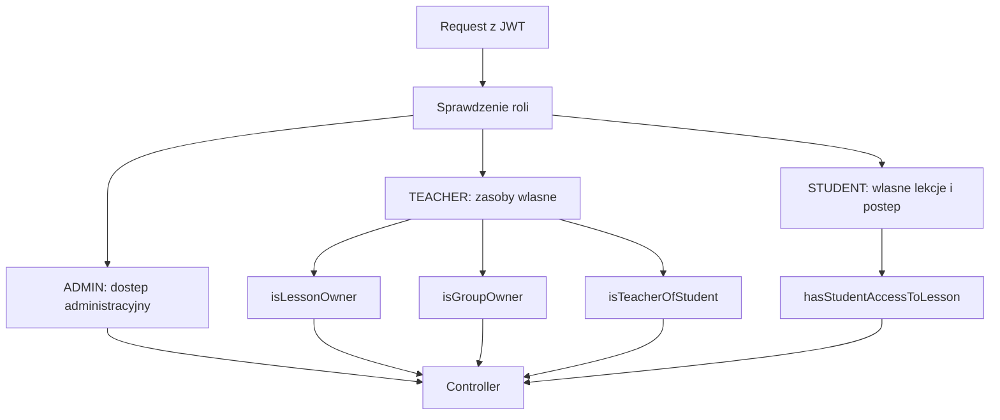

# Kontrakt API

Zrodlem prawdy kontraktu jest [api-contract.md](../../api-contract.md), kontrolery backendu i testy API. Ta notatka pokazuje, jak z niego korzystac w Obsidianie.

## Zasada aktualizacji

Przy zmianie endpointu aktualizuj razem:
- kontroler i DTO w backendzie,
- [api-contract.md](../../api-contract.md),
- odpowiedni plik `.http` w [backend/http](../../backend/http),
- testy API w [api-tests/tests](../../api-tests/tests),
- link w [[Mapa API]], jesli endpoint jest nowy.

## Grupy endpointow

| Obszar | Endpointy | Rola bazowa | Notatki |
|---|---|---|---|
| Auth | `POST /api/v1/auth/login` | public | [[Przeplyw - logowanie i sesja]] |
| Users | `/api/v1/users/**` | authenticated + owner/admin | [[Domena - uzytkownicy]] |
| Admin BFF | `/api/v1/admin/**` | `ADMIN` | [[Rola - Admin]] |
| Teacher BFF | `/api/v1/teacher/**` | `TEACHER` | [[Rola - Teacher]] |
| Student BFF | `/api/v1/student/**` | `STUDENT` | [[Rola - Student]] |
| Lessons | `/api/v1/lessons` | `TEACHER` lub `ADMIN` | [[Domena - lekcje]] |
| Tasks | `/api/v1/lessons/{lessonId}/tasks/**` | zalezne od akcji | [[Domena - zadania]] |
| Groups | `/api/v1/user-groups/**` | `TEACHER` lub `ADMIN` | [[Domena - grupy]] |

## DTO

DTO sa trzymane per modul:
- `auth/dto`: logowanie i token.
- `user/dto`: profil, rejestracja, zmiana hasla.
- `admin/dto`: dashboard admina i zarzadzanie uczniami.
- `teacher/dto`: dashboard nauczyciela, statystyki lekcji, uczniowie nauczyciela.
- `student/dto`: dashboard ucznia, lekcje i postep.
- `lesson/dto`: tworzenie, edycja i status lekcji.
- `task/dto`: zadania, sekcje, odpowiedzi, submit, transkrypcja.
- `usergroup/dto`: grupy i czlonkostwo.

## Statusy bledow

| Status | Kiedy oczekiwac | Przyklady |
|---|---|---|
| `400` | Walidacja, niepoprawny payload, zly stan biznesowy. | `VALIDATION_FAILED`, lekcja nie wystartowana. |
| `401` | Brak tokenu, token nieprawidlowy, zle dane logowania. | `INVALID_CREDENTIALS`, `TOKEN_EXPIRED`. |
| `403` | Rola lub ownership nie pozwala na operacje. | nauczyciel edytuje cudza lekcje. |
| `404` | Brak zasobu. | `USER_NOT_FOUND`, `LESSON_NOT_FOUND`, `USER_GROUP_NOT_FOUND`. |
| `409` | Konflikt unikalnosci albo reguly przypisania. | email zajety, username zajety, uczen juz w grupie. |
| `503` | Niedostepna integracja zewnetrzna. | STT dla zadania `speak`. |

## Autoryzacja i ownership



Szczegoly sa w [[Security]] i [[Macierz rol i uprawnien]].

## Przykladowy request

```http
POST /api/v1/auth/login
Content-Type: application/json

{
  "emailOrUsername": "admin@szkola.pl",
  "password": "admin1"
}
```

```http
GET /api/v1/users/me
Authorization: Bearer <token>
```

Powiazane:
- [[Mapa API]]
- [[Bledy API]]
- [[Testy]]
