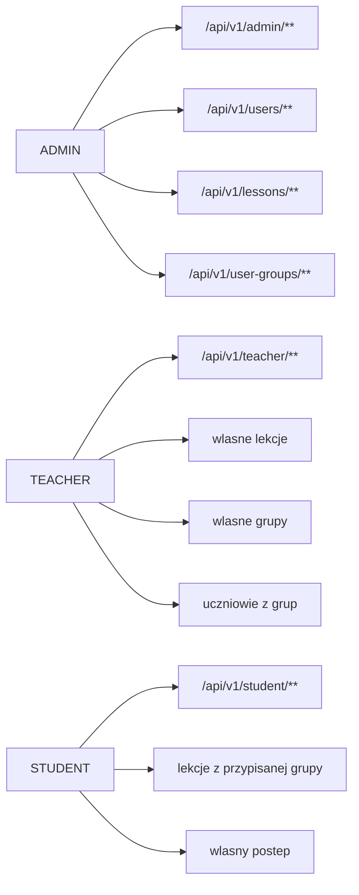

# Macierz rol i uprawnien

Macierz laczy widoki, endpointy i reguly ownership. Szczegolowe checki sa w [[Security]].

## Widoki frontendu

| Widok | Admin | Teacher | Student | Uwagi |
|---|---:|---:|---:|---|
| `/login` | tak | tak | tak | Publiczny formularz logowania. |
| `/admin` | tak | nie | nie | Chroniony przez `ProtectedRoute(["ADMIN"])`. |
| `/teacher` | nie | tak | nie | Dashboard nauczyciela. |
| `/teacher/students` | nie | tak | nie | Uczniowie przypisani do grup nauczyciela. |
| `/teacher/lessons/:lessonPublicId/stats` | nie | tak | nie | Wyniki lekcji nauczyciela. |
| `/student` | nie | nie | tak | Dashboard ucznia. |
| `/student/lessons/:lessonPublicId` | nie | nie | tak | Rozwiazywanie lekcji. |

## Operacje domenowe

| Operacja | Admin | Teacher | Student | Regula |
|---|---:|---:|---:|---|
| Tworzy admina | tak | nie | nie | `POST /api/v1/users/admin`. |
| Tworzy nauczyciela | tak | nie | nie | `POST /api/v1/users/teacher`. |
| Tworzy ucznia | tak | tak | nie | Admin globalnie, nauczyciel w swoim zakresie. |
| Czyta wlasny profil | tak | tak | tak | `GET /api/v1/users/me`. |
| Czyta profil innej osoby | tak | czesciowo | nie | Teacher tylko swojego ucznia. |
| Edytuje profil | tak | tylko siebie | tylko siebie | Admin albo owner. |
| Zmienia awatar | tak | tylko siebie | tylko siebie | Admin albo owner; upload JPEG/PNG albo preset. |
| Usuwa konto | tak | tylko siebie | tylko siebie | Admin albo owner. |
| Tworzy lekcje | tak | tak | nie | `POST /api/v1/lessons`. |
| Edytuje lekcje | tak | tylko wlasciciel | nie | `isLessonOwner`. |
| Zmienia status lekcji | tak | tylko wlasciciel | nie | `PATCH /api/v1/lessons/{lessonPublicId}/status`. |
| Usuwa lekcje | tak | tylko wlasciciel | nie | `DELETE /api/v1/lessons/{lessonPublicId}`. |
| Czyta zadania lekcji | tak | tak | tak | Student musi miec dostep przez grupe i stan lekcji. |
| Tworzy/edytuje/usuwa zadania | tak | tylko wlasciciel lekcji | nie | `isLessonOwner`. |
| Wysyla odpowiedzi do lekcji | nie | nie | tak | `POST /api/v1/lessons/{lessonPublicId}/submit`. |
| Transkrybuje odpowiedz audio | nie | nie | tak | `POST /tasks/speak/{taskPublicId}/transcribe`. |
| Resetuje postep ucznia | tak | tylko wlasciciel lekcji | nie | `POST /users/{userPublicId}/reset`. |
| Tworzy grupe | tak | tak | nie | `POST /api/v1/user-groups`. |
| Edytuje grupe | tak | tylko wlasciciel | nie | `isGroupOwner`. |
| Dodaje/usuwa ucznia z grupy | tak | tylko wlasciciel | nie | `isGroupOwner`. |

## Edge case'y security

- Teacher nie powinien zobaczyc ucznia spoza swoich grup.
- Teacher nie powinien edytowac lekcji ani zadan innego nauczyciela.
- Student nie powinien wejsc w lekcje, ktora nie jest przypisana do jego grupy.
- Student nie powinien ponownie rozwiazywac lekcji oznaczonej jako zakonczona, chyba ze postep zostal zresetowany.
- Admin moze wykonywac operacje administracyjne, ale publiczne endpointy nadal powinny pozostac minimalne.
- Zmiana hasla wymaga starego hasla dla wlasciciela konta.
- Zmiana awatara musi byc ograniczona do admina albo wlasciciela konta.
- STT musi zwrocic blad kontrolowany, gdy serwis transkrypcji nie odpowiada.

## Szybka mapa

Zrodla:
- [SecurityConfig.java](../../backend/src/main/java/pl/freeedu/backend/security/config/SecurityConfig.java)
- [SecurityService.java](../../backend/src/main/java/pl/freeedu/backend/security/service/SecurityService.java)
- [App.tsx](../../frontend/src/App.tsx)
- [[Awatary uzytkownikow]]
