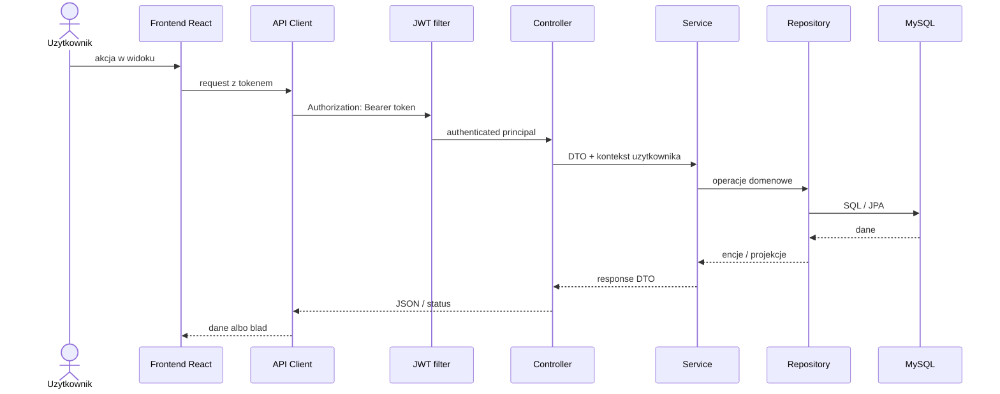
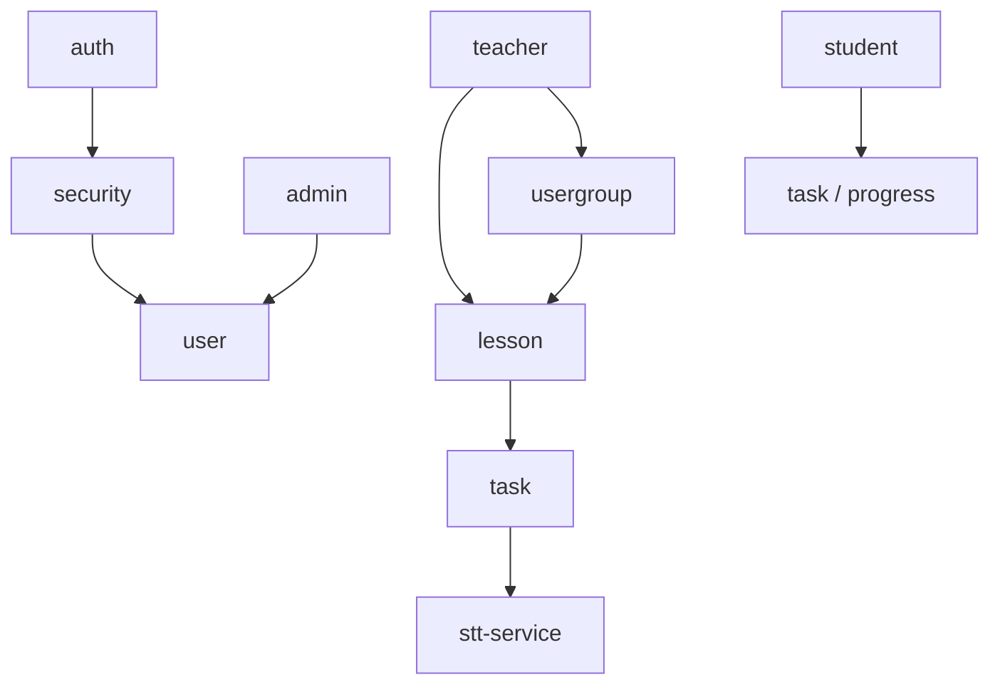

# Mapa architektury

FreeEdu sklada sie z frontendu React, backendu Spring Boot WebFlux, bazy MySQL zarzadzanej przez Flyway oraz osobnego serwisu STT dla zadan mowionych.

## Przeplyw requestu

## Warstwy

| Warstwa | Odpowiedzialnosc | Gdzie szukac |
|---|---|---|
| Frontend routes | Widoki i dostep per rola. | [App.tsx](../../frontend/src/App.tsx) |
| API client | Axios/fetch wrapper i serwisy per modul. | [frontend/src/api](../../frontend/src/api) |
| Auth context | Token, rola, profil, redirecty. | [AuthContext.tsx](../../frontend/src/context/AuthContext.tsx) |
| Protected route | Guard widokow po tokenie i roli. | [ProtectedRoute.tsx](../../frontend/src/components/ProtectedRoute.tsx) |
| Controllers | Endpointy HTTP i statusy. | [backend controllers](../../backend/src/main/java/pl/freeedu/backend) |
| Services | Reguly biznesowe, ownership, transakcje domenowe. | [backend services](../../backend/src/main/java/pl/freeedu/backend) |
| Repositories | Dostep do bazy przez JPA. | [backend repositories](../../backend/src/main/java/pl/freeedu/backend) |
| Migrations | Schemat bazy i ewolucja tabel. | [db/migration](../../backend/src/main/resources/db/migration) |
| STT | Transkrypcja audio dla zadan `speak`. | [stt-service](../../stt-service) |

## Moduly backendu

## Gdzie szukac zmian

- Logowanie i sesja: `auth`, `security`, `frontend/src/context/AuthContext.tsx`.
- Widoki roli: `frontend/src/features/admin`, `frontend/src/features/teacher`, `frontend/src/features/student`.
- Lekcje: `lesson` w backendzie, `lessonService.ts` w frontendzie.
- Zadania: `task` w backendzie, komponenty w `frontend/src/components/student` i `frontend/src/components/teacher`.
- Grupy: `usergroup` w backendzie, `userGroupService.ts` w frontendzie.
- Testy API: `api-tests/tests` oraz `.http` w `backend/http`.

Powiazane:
- [[Mapa systemu]]
- [[Kontrakt API]]
- [[Macierz rol i uprawnien]]
- [[Role Flows/README - Role Flows|Role Flows]]
