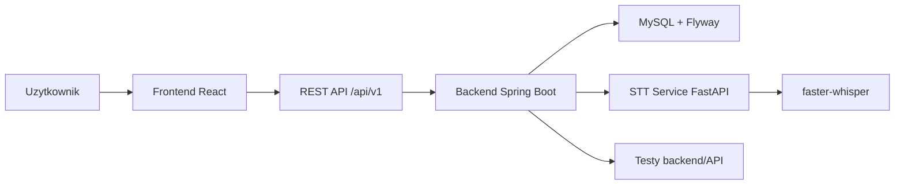

# Mapa systemu

[[Frontend]] komunikuje sie z [[Backend]] przez [[Mapa API]]. [[Backend]] zapisuje dane w [[Model danych]] i wywoluje [[STT Service]] podczas zadan mowionych. Calosc lokalnie spina [[Docker i runtime]].

Polaczenia modulow:
- [[Frontend]] -> [[API Client]] -> [[Mapa API]]
- [[Backend]] -> [[Security]] -> [[Domena - uzytkownicy]]
- [[Backend]] -> [[Domena - lekcje]] -> [[Domena - zadania]]
- [[Domena - grupy]] laczy [[Rola - Teacher]] z [[Rola - Student]]
- [[Domena - postep studenta]] laczy [[Domena - uzytkownicy]], [[Domena - lekcje]] i [[Domena - zadania]]
- [[STT Service]] jest uzywany przez [[Przeplyw - rozpoznawanie mowy]]

Zrodla:
- [docker-compose.yml](../../docker-compose.yml)
- [README.md](../../README.md)
- [application.yaml](../../backend/src/main/resources/application.yaml)
