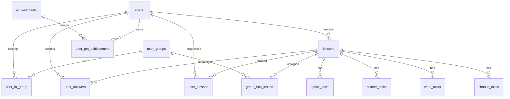

# Model danych

Model danych jest utrzymywany przez Flyway i uzywany przez [[Backend]].

Tabele domenowe:
- `users` -> [[Domena - uzytkownicy]]
- `user_groups`, `user_in_group`, `group_has_lesson` -> [[Domena - grupy]]
- `lessons` -> [[Domena - lekcje]]
- `choose_tasks`, `write_tasks`, `scatter_tasks`, `speak_tasks` -> [[Domena - zadania]]
- `user_lessons`, `user_answers` -> [[Domena - postep studenta]]
- `achievements`, `user_get_achievement` -> przyszly obszar osiagniec

Wazne ograniczenia:
- `user_in_group` ma `UNIQUE (user_id)`, czyli uczen nalezy do jednej grupy.
- `user_lessons` ma `UNIQUE (user_id, lesson_id)`, czyli jeden stan postepu na pare uczen-lekcja.
- zadania maja wspolne pola `hint` i `section`.
- `users.avatar_url` przechowuje preset awatara albo sciezke do pliku uploadowanego przez backend -> [[Awatary uzytkownikow]]

Zrodla:
- [migrations](../../backend/src/main/resources/db/migration)
- [seed](../../backend/src/main/resources/db/seed/V2_1__seed_tables.sql)
