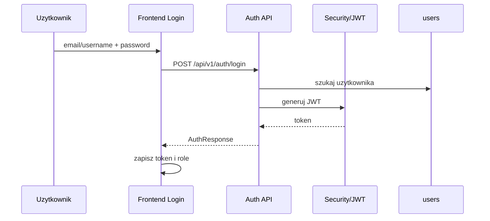

# Przeplyw - logowanie i sesja

Wezly:
- [[Frontend - Login]]
- [[API Client]]
- [[Backend]]
- [[Security]]
- [[Domena - uzytkownicy]]

Zrodla:
- [AuthController.java](../../backend/src/main/java/pl/freeedu/backend/auth/controller/v1/AuthController.java)
- [AuthService.java](../../backend/src/main/java/pl/freeedu/backend/auth/service/AuthService.java)
- [Login.tsx](../../frontend/src/features/auth/Login.tsx)
