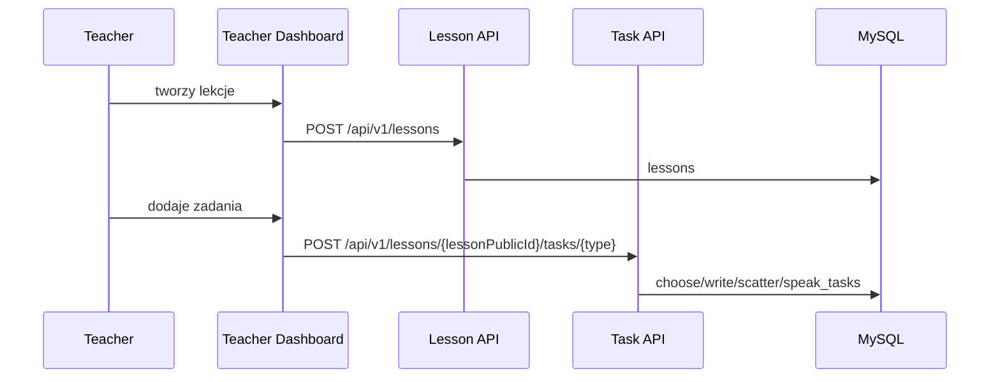

# Przeplyw - nauczyciel tworzy lekcje

Wezly:
- [[Rola - Teacher]]
- [[Frontend - Teacher Dashboard]]
- [[Teacher Dashboard]]
- [[Domena - lekcje]]
- [[Domena - zadania]]
- [[Domena - grupy]]
- [[Security]]

Reguly:
- nauczyciel moze edytowac lekcje, jezeli jest jej wlascicielem
- admin moze wykonywac operacje wlascicielskie
- zadanie musi nalezec do lekcji wskazanej w URL

Zrodla:
- [LessonService.java](../../backend/src/main/java/pl/freeedu/backend/lesson/service/LessonService.java)
- [TaskService.java](../../backend/src/main/java/pl/freeedu/backend/task/service/TaskService.java)
