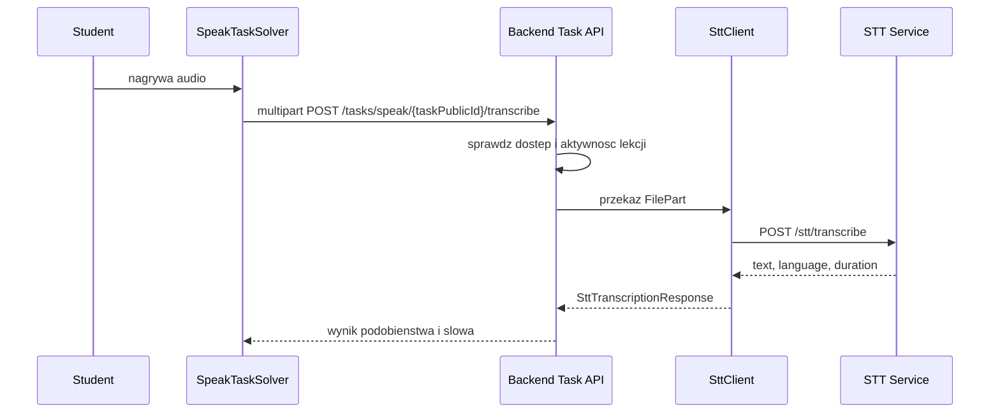

# Przeplyw - rozpoznawanie mowy

Wezly:
- [[Frontend - Lesson Solver]]
- [[Domena - zadania]]
- [[Domena - postep studenta]]
- [[STT Service]]
- [[Docker i runtime]]

Reguly:
- tylko student wywoluje endpoint transkrypcji
- student musi miec dostep do lekcji
- lekcja musi byc aktywna
- backend porownuje transkrypcje z `expectedText`

Zrodla:
- [SpeakTaskSolver.tsx](../../frontend/src/components/student/SpeakTaskSolver.tsx)
- [SttClient.java](../../backend/src/main/java/pl/freeedu/backend/task/service/SttClient.java)
- [main.py](../../stt-service/app/main.py)
