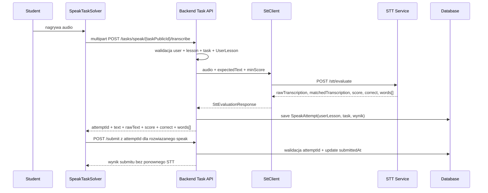

# Przeplyw - rozpoznawanie mowy

```mermaid
sequenceDiagram
  participant S as Student
  participant F as SpeakTaskSolver
  participant B as Backend Task API
  participant C as SttClient
  participant STT as STT Service
  participant DB as Database

  S->>F: nagrywa audio
  F->>B: multipart POST /tasks/speak/{taskPublicId}/transcribe
  B->>B: walidacja user + lesson + task + UserLesson
  B->>C: audio + expectedText + minScore
  C->>STT: POST /stt/evaluate
  STT-->>C: rawTranscription, matchedTranscription, score, correct, words[]
  C-->>B: SttEvaluationResponse
  B->>DB: save SpeakAttempt(userLesson, task, wynik)
  B-->>F: attemptId + text + rawText + score + correct + words[]
  F->>B: POST /submit z attemptId dla rozwiazanego speak
  B->>DB: walidacja attemptId + update submittedAt
  B-->>F: wynik submitu bez ponownego STT
```

Reguly:
- tylko student wywoluje endpoint transkrypcji
- backend nie robi juz scoringu STT lokalnie
- `SpeakAttempt` jest przypiety do konkretnego `UserLesson`
- backend nie ufa samemu `answer` dla taska `speak`
- brak `attemptId` nie blokuje submitu calej lekcji, jesli speaking task jest pominiety
- pominiety speaking task jest traktowany jako incorrect / 0 pkt dla tego taska
- cleanup usuwa stare nieuzyte attempty
- limit attemptow dziala per `userLesson + task`

Zrodla:
- [SpeakTaskSolver.tsx](../../frontend/src/components/student/SpeakTaskSolver.tsx)
- [TaskService.java](../../backend/src/main/java/pl/freeedu/backend/task/service/TaskService.java)
- [SttClient.java](../../backend/src/main/java/pl/freeedu/backend/task/service/SttClient.java)
- [SpeakAttempt.java](../../backend/src/main/java/pl/freeedu/backend/task/model/SpeakAttempt.java)
- [main.py](../../stt-service/app/main.py)
