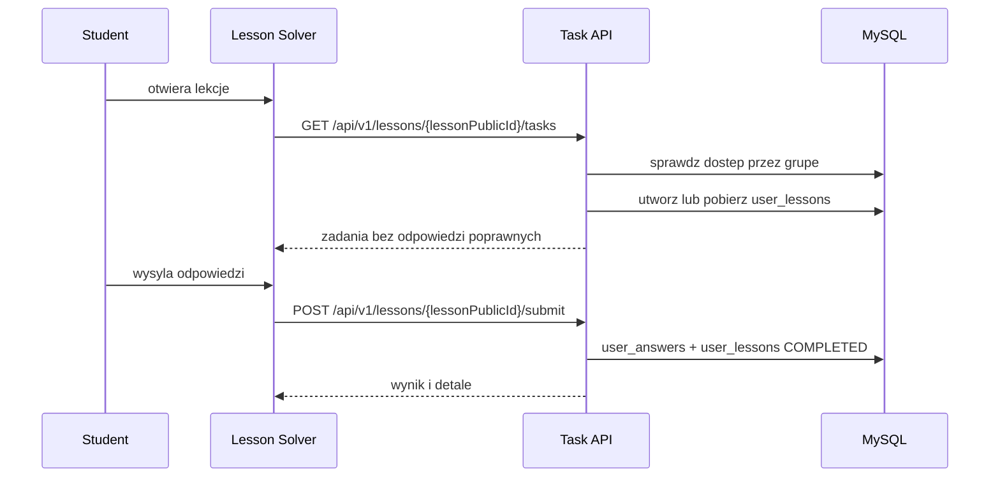

# Przeplyw - student rozwiazuje lekcje

Wezly:
- [[Rola - Student]]
- [[Frontend - Lesson Solver]]
- [[Domena - grupy]]
- [[Domena - lekcje]]
- [[Domena - zadania]]
- [[Domena - postep studenta]]

Reguly:
- student musi miec dostep do lekcji przez grupe
- lekcja musi byc aktywna
- zakonczona lekcja nie moze byc rozwiazywana ponownie bez resetu

Zrodla:
- [TaskService.java](../../backend/src/main/java/pl/freeedu/backend/task/service/TaskService.java)
- [LessonSolver.tsx](../../frontend/src/features/student/LessonSolver.tsx)
