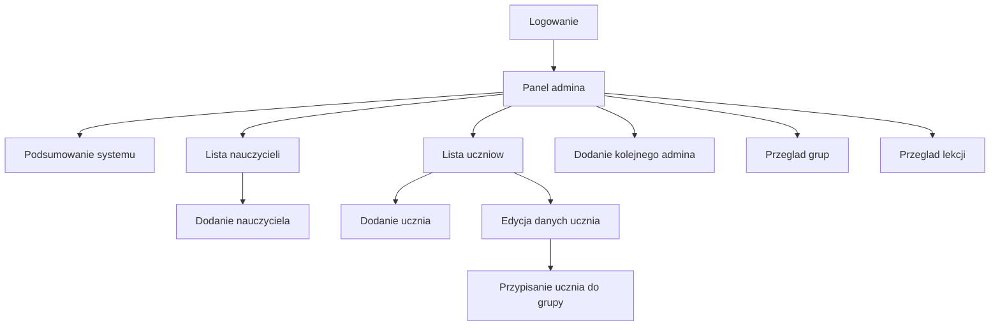

# Admin - mapa przejsc

Admin po zalogowaniu trafia do panelu zarzadzania. Z tego miejsca widzi ogolny stan systemu i zarzadza kontami nauczycieli oraz uczniow.

## Mapa

## Co widzi admin

| Obszar | Po co jest | Co admin moze zrobic |
|---|---|---|
| Podsumowanie systemu | Szybki obraz liczby uzytkownikow, lekcji i aktywnosci. | Sprawdzic, czy system zyje i gdzie jest najwiecej danych. |
| Nauczyciele | Lista kont nauczycieli. | Dodac nauczyciela albo sprawdzic istniejace konto. |
| Uczniowie | Lista uczniow z informacja o grupie. | Dodac ucznia, poprawic dane, przypisac do grupy. |
| Grupy | Obszar organizacji uczniow. | Sprawdzic, do jakich grup trafiaja uczniowie. |
| Lekcje | Obszar materialow w systemie. | Sprawdzic, jakie lekcje istnieja. |

## Zasady dostepu

- Tylko admin widzi panel admina.
- Nauczyciel i uczen po zalogowaniu trafiaja do swoich paneli, nie do panelu admina.
- Przy dodawaniu kont system sprawdza, czy email i nazwa uzytkownika nie sa juz zajete.
- Przy przypisywaniu ucznia system sprawdza, czy wybrana grupa istnieje.

## Sytuacje problemowe

- Admin wpisuje email, ktory juz jest zajety.
- Admin probuje przypisac ucznia do grupy, ktora nie istnieje.
- Formularz ma brakujace albo niepoprawne dane.
- Osoba bez roli admina probuje wejsc do panelu admina.

## Dla zespolu technicznego

Szczegoly techniczne sa w:
- [[Kontrakt API]]
- [[Mapa API]]
- [[Macierz rol i uprawnien]]

Powiazane:
- [[Rola - Admin]]
- [[Role Flows/Admin - zarzadzanie uzytkownikami]]
- [[Macierz rol i uprawnien]]
