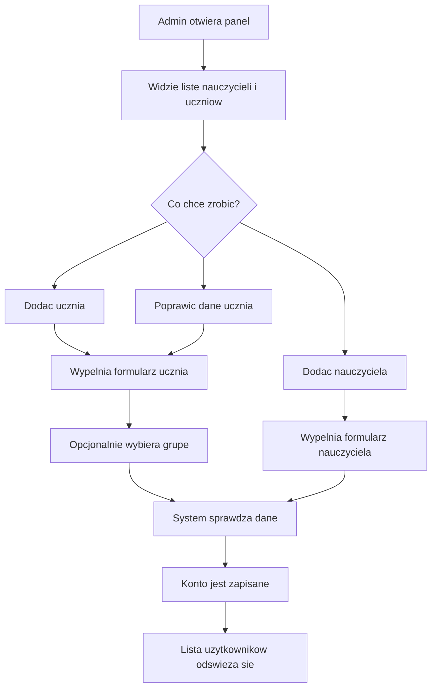

# Admin - zarzadzanie uzytkownikami

Flow opisuje, jak admin dodaje albo poprawia konta uzytkownikow.

## Typowa sciezka

1. Admin loguje sie przez [[Przeplyw - logowanie i sesja]].
2. Trafia do panelu admina.
3. Widzi nauczycieli, uczniow i ogolne podsumowanie.
4. Wybiera akcje: dodanie nauczyciela, dodanie ucznia albo edycje ucznia.
5. Wypelnia formularz.
6. System sprawdza, czy dane sa poprawne i unikalne.
7. Po zapisie lista uzytkownikow odswieza sie.

## Sytuacje problemowe

- Email albo nazwa uzytkownika sa juz zajete.
- Wybrana grupa nie istnieje.
- Formularz ma braki albo niepoprawne dane.
- Osoba bez roli admina probuje wykonac akcje administracyjna.

## Dla zespolu technicznego

- [AdminDashboard.tsx](../../../frontend/src/features/admin/AdminDashboard.tsx)
- [adminService.ts](../../../frontend/src/api/adminService.ts)
- [AdminDashboardController.java](../../../backend/src/main/java/pl/freeedu/backend/admin/controller/v1/AdminDashboardController.java)
- [AdminService.java](../../../backend/src/main/java/pl/freeedu/backend/admin/service/AdminService.java)
