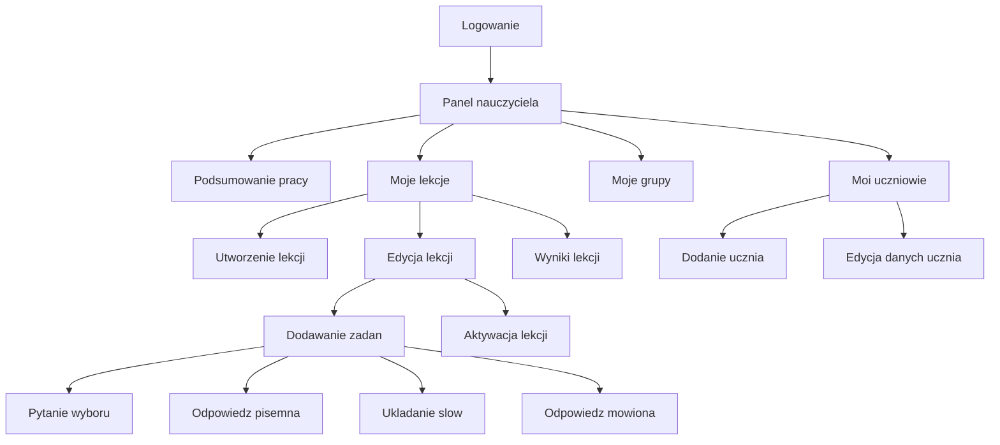

# Nauczyciel - mapa przejsc

Nauczyciel po zalogowaniu trafia do panelu pracy. Z tego miejsca przygotowuje lekcje, dodaje zadania, sprawdza uczniow i analizuje wyniki.

## Mapa

## Co widzi nauczyciel

| Obszar | Po co jest | Co nauczyciel moze zrobic |
|---|---|---|
| Podsumowanie pracy | Szybki obraz lekcji, uczniow i wynikow. | Zobaczyc, co wymaga uwagi. |
| Moje lekcje | Lista lekcji nauczyciela. | Utworzyc lekcje, edytowac ja, aktywowac albo wylaczyc. |
| Zadania w lekcji | Tresc, ktora rozwiazuje uczen. | Dodac pytanie wyboru, pisanie, ukladanie slow lub odpowiedz mowiona. |
| Moje grupy | Grupy przypisane do nauczyciela. | Wybrac, ktore grupy maja dostac lekcje. |
| Moi uczniowie | Uczniowie z grup nauczyciela. | Dodac ucznia albo poprawic jego dane. |
| Wyniki lekcji | Podsumowanie pracy uczniow. | Sprawdzic, jak uczniowie poradzili sobie z lekcja. |

## Zasady dostepu

- Nauczyciel widzi tylko swoj panel pracy.
- Nauczyciel pracuje na swoich lekcjach, swoich grupach i swoich uczniach.
- Lekcja staje sie widoczna dla uczniow dopiero wtedy, gdy jest aktywna i przypisana do ich grupy.
- Nauczyciel nie powinien edytowac lekcji ani grup innego nauczyciela.

## Sytuacje problemowe

- Nauczyciel probuje zmienic cudza lekcje.
- Nauczyciel wybiera grupe, do ktorej nie ma dostepu.
- Lekcja nie ma zadan albo nie jest przypisana do grupy.
- Uczen ma juz zapisany postep i trzeba zdecydowac, czy mozna go zresetowac.

## Dla zespolu technicznego

Szczegoly techniczne sa w:
- [[Kontrakt API]]
- [[Mapa API]]
- [[Macierz rol i uprawnien]]

Powiazane:
- [[Rola - Teacher]]
- [[Role Flows/Nauczyciel - tworzenie lekcji]]
- [[Przeplyw - nauczyciel tworzy lekcje]]
