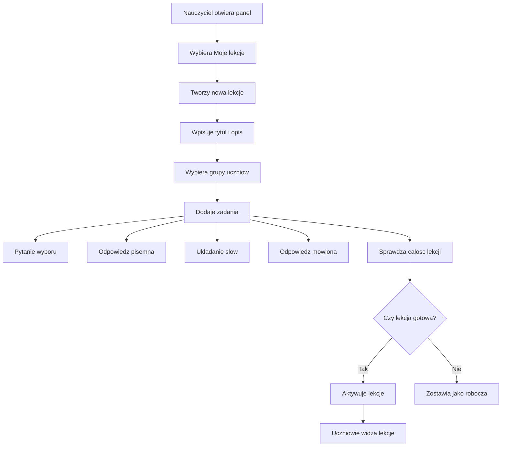

# Nauczyciel - tworzenie lekcji

Flow pokazuje, jak nauczyciel przechodzi od pomyslu na lekcje do materialu widocznego dla uczniow.

## Typowa sciezka

1. Nauczyciel loguje sie i trafia do swojego panelu.
2. Widzi swoje lekcje oraz grupy uczniow.
3. Nauczyciel tworzy lekcje z tytulem, opisem, statusem i grupami.
4. Nauczyciel dodaje zadania w sekcjach.
5. Nauczyciel sprawdza, czy lekcja jest gotowa.
6. Po aktywacji uczniowie z przypisanych grup widza lekcje w swoim panelu.

## Typy zadan

| Typ | Co robi uczen |
|---|---|
| Pytanie wyboru | Wybiera poprawna odpowiedz. |
| Odpowiedz pisemna | Wpisuje odpowiedz tekstowa. |
| Ukladanie slow | Uklada slowa w poprawnej kolejnosci. |
| Odpowiedz mowiona | Nagrywa odpowiedz glosowa. |

## Sytuacje problemowe

- Brakuje tytulu, opisu albo innych wymaganych danych.
- Lekcja nie ma przypisanej grupy.
- Lekcja nie ma zadnych zadan.
- Nauczyciel probuje edytowac lekcje, ktora nie nalezy do niego.

## Dla zespolu technicznego

Szczegoly techniczne sa w [[Kontrakt API]] i [[Mapa API]].

Powiazane:
- [[Przeplyw - nauczyciel tworzy lekcje]]
- [[Domena - lekcje]]
- [[Domena - zadania]]
- [[Kontrakt API]]
