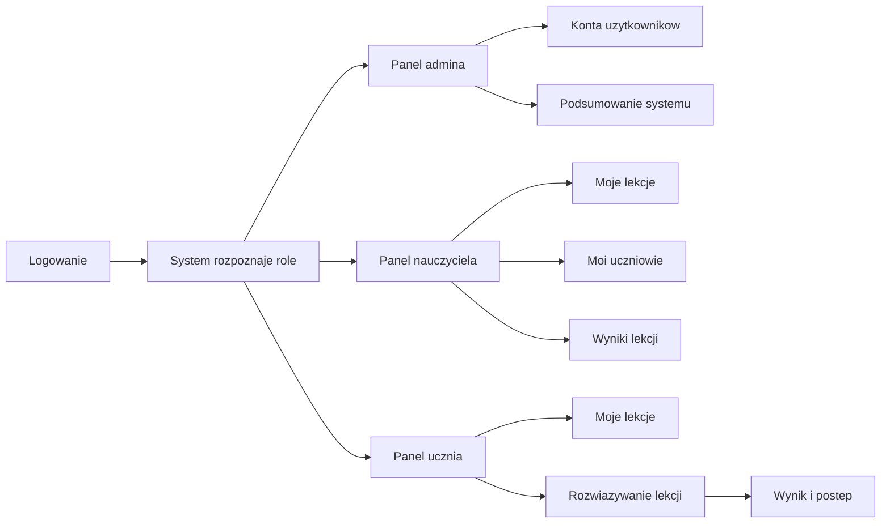

# Role Flows

Folder opisuje przejscia przez aplikacje z perspektywy osoby korzystajacej z systemu. Mapy maja odpowiadac na proste pytania:
- gdzie uzytkownik trafia po zalogowaniu,
- co widzi na ekranie,
- jaka akcje moze wykonac,
- co dzieje sie po tej akcji.

Techniczne szczegoly sa w [[Kontrakt API]], [[Mapa API]] i [[Macierz rol i uprawnien]].

## Mapy roli

- [[Role Flows/Admin - mapa przejsc|Admin - mapa przejsc]]
- [[Role Flows/Nauczyciel - mapa przejsc|Nauczyciel - mapa przejsc]]
- [[Role Flows/Uczen - mapa przejsc|Uczen - mapa przejsc]]

## Konkretne flow

- [[Role Flows/Admin - zarzadzanie uzytkownikami|Admin - zarzadzanie uzytkownikami]]
- [[Role Flows/Nauczyciel - tworzenie lekcji|Nauczyciel - tworzenie lekcji]]
- [[Role Flows/Uczen - rozwiazywanie lekcji|Uczen - rozwiazywanie lekcji]]

## Legenda

| Element | Znaczenie |
|---|---|
| Ekran | Miejsce w aplikacji, ktore widzi uzytkownik. |
| Akcja | To, co uzytkownik moze kliknac albo wypelnic. |
| Lista | Zbior danych widoczny na ekranie, np. uczniowie albo lekcje. |
| Wynik | Efekt akcji, np. nowe konto, opublikowana lekcja albo zapisany wynik. |
| Problem | Sytuacja, ktora system powinien jasno obsluzyc. |

## Mapa wysokiego poziomu

Powiazane:
- [[Start]]
- [[Frontend]]
- [[Kontrakt API]]
- [[Macierz rol i uprawnien]]
