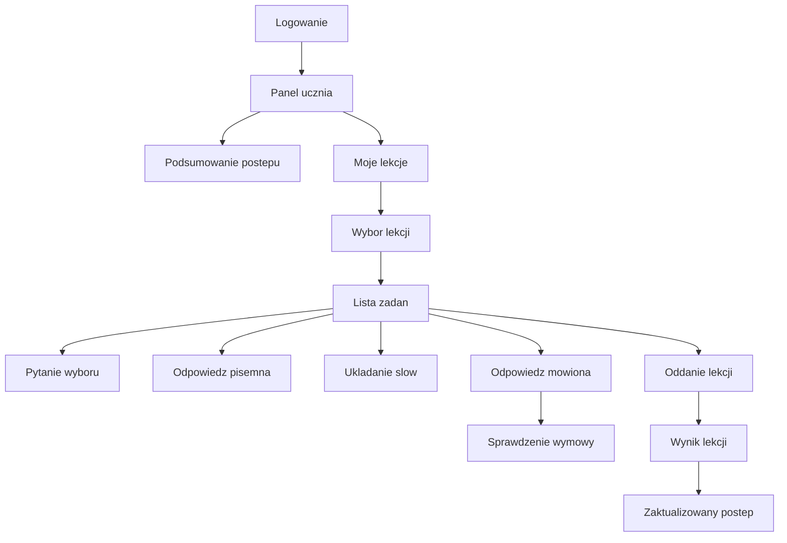

# Uczen - mapa przejsc

Uczen po zalogowaniu trafia do swojego panelu. Widzi tylko lekcje przypisane do jego grupy, rozwiazuje zadania i dostaje wynik.

## Mapa

## Co widzi uczen

| Obszar | Po co jest | Co uczen moze zrobic |
|---|---|---|
| Podsumowanie postepu | Pokazuje, ile pracy uczen ma za soba. | Sprawdzic swoj aktualny postep. |
| Moje lekcje | Lista lekcji dostepnych dla ucznia. | Wybrac lekcje do rozwiazania. |
| Lista zadan | Zadania w wybranej lekcji. | Rozwiazac kolejne typy zadan. |
| Odpowiedz mowiona | Zadanie wymagajace nagrania glosu. | Nagrac odpowiedz i dostac ocene wymowy. |
| Wynik lekcji | Podsumowanie po oddaniu. | Zobaczyc wynik i zapisany postep. |

## Zasady dostepu

- Uczen widzi tylko swoje lekcje.
- Lekcja jest dostepna, jesli nauczyciel przypisal ja do grupy ucznia i ja aktywowal.
- Uczen oddaje lekcje jako calosc.
- Po zakonczeniu lekcji system zapisuje wynik i postep.

## Sytuacje problemowe

- Uczen probuje wejsc w lekcje, ktora nie jest dla jego grupy.
- Lekcja jest jeszcze nieaktywna.
- Lekcja zostala juz zakonczona.
- Uczen nie nagral pliku audio w zadaniu mowionym.
- Sprawdzanie wymowy jest chwilowo niedostepne.

## Dla zespolu technicznego

Szczegoly techniczne sa w:
- [[Kontrakt API]]
- [[Mapa API]]
- [[Macierz rol i uprawnien]]

Powiazane:
- [[Rola - Student]]
- [[Role Flows/Uczen - rozwiazywanie lekcji]]
- [[Przeplyw - student rozwiazuje lekcje]]
