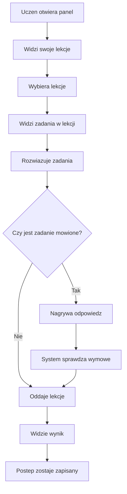

# Uczen - rozwiazywanie lekcji

Flow opisuje, jak uczen wybiera lekcje, rozwiazuje zadania i dostaje wynik.

## Typowa sciezka

1. Uczen loguje sie i trafia do swojego panelu.
2. Widzi swoje lekcje i ogolny postep.
3. Uczen otwiera aktywna lekcje.
4. Widzi zadania pogrupowane w sekcje.
5. Rozwiazuje zadania.
6. Jesli lekcja ma zadanie mowione, uczen nagrywa odpowiedz i dostaje ocene wymowy.
7. Uczen oddaje lekcje.
8. System pokazuje wynik i zapisuje postep.

## Sytuacje problemowe

- Uczen nie ma dostepu do danej lekcji.
- Lekcja jest nieaktywna.
- Lekcja zostala juz zakonczona.
- Brakuje wymaganej odpowiedzi.
- W zadaniu mowionym nie ma nagrania.
- Sprawdzanie wymowy jest chwilowo niedostepne.

## Dla zespolu technicznego

- [StudentDashboard.tsx](../../../frontend/src/features/student/StudentDashboard.tsx)
- [LessonSolver.tsx](../../../frontend/src/features/student/LessonSolver.tsx)
- [taskService.ts](../../../frontend/src/api/taskService.ts)
- [TaskController.java](../../../backend/src/main/java/pl/freeedu/backend/task/controller/v1/TaskController.java)
- [TaskService.java](../../../backend/src/main/java/pl/freeedu/backend/task/service/TaskService.java)
